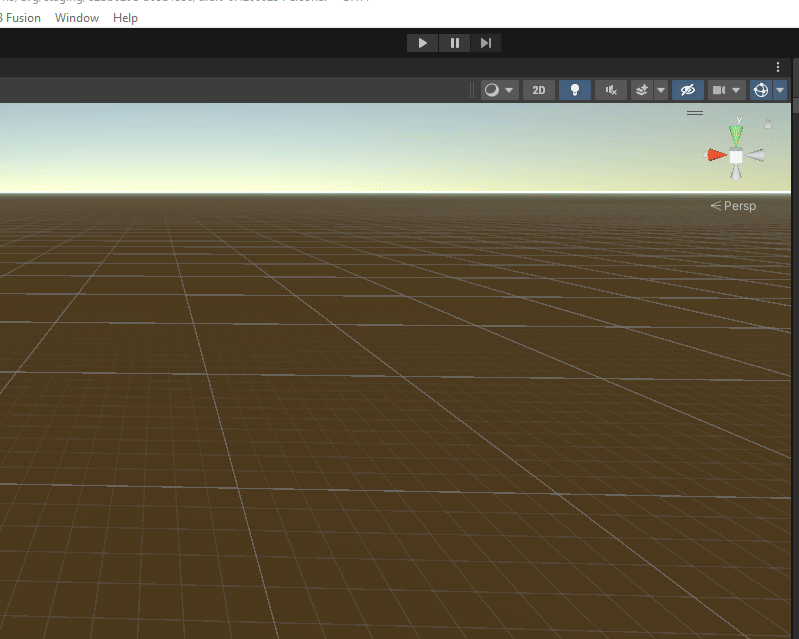

# Ult Utils

UltUtils is a collection of editor context menus and Prefabs for creating UltEvent logic for BONELAB.

## Installation

The best way to install Ult Utils is via Unity's built in package manager (UPM). Add the following packages:

<details>
<summary>Where to add the packages</summary>



</details>

> [!TIP]
> Use the copy to clipboard button in the corner to avoid trailing spaces when copying these links!

```
https://github.com/holadivinus/BLXRComp.git
```

```
https://github.com/Lava-Pals/ult-utils.git
```
